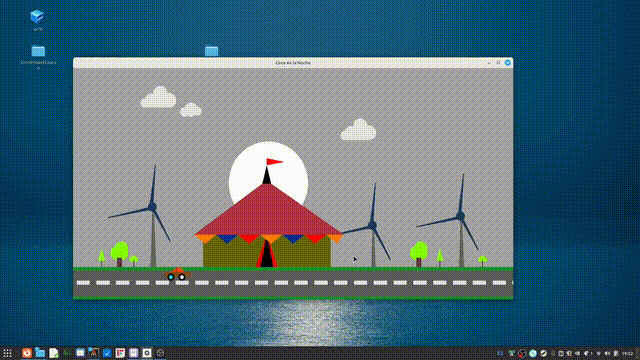

# Proyecto Final de Graficos por Computadores


```markdown
# Circo en la Noche - Proyecto de Gráficos por Computadora 🎪🌙
```
Este es un proyecto realizado como parte del curso de **Gráficos por Computadora**. El programa genera una animación gráfica utilizando **OpenGL** y representa un escenario que incluye un circo, un molino, árboles, y un cielo dinámico con nubes y la luna en movimiento.


## 🚀 Requisitos

Asegúrate de tener instalados los siguientes programas y bibliotecas:

1. **g++ (Compilador de C++)**:
   ```bash
   sudo apt install g++
   ```
2. **FreeGLUT y bibliotecas de OpenGL**:
   ```bash
   sudo apt install freeglut3 freeglut3-dev libglu1-mesa-dev
   ```


## 🖥️ Ejecución del Programa

Sigue estos pasos para compilar y ejecutar el programa:

1. **Clona el repositorio o descarga el código fuente:**
   ```bash
   git clone https://github.com/Hes01/CursoGraficosxComputadoras.git
   cd CursoGraficosxComputadoras
   ```

2. **Compila el programa usando `g++`:**
   ```bash
   g++ circo.cpp -o circo -lGL -lGLU -lglut -lm
   ```

3. **Ejecuta el programa:**
   Ejecuta el programa doble click a circo o con la terminal escribiendo.
   ```bash
   ./circo
   ```

---

## 🎮 Controles

- **Botón izquierdo del mouse**: Inicia el movimiento de los elementos .
- **Botón central del mouse**: Mueve solo la luna(Aunque me falto completar esto).
- **Botón derecho del mouse**: Detiene todo movimiento.

---

## 📂 Fuente del Proyecto

- **`circo.cpp`**: Código fuente principal que contiene la lógica de renderizado, animación y controles.

---

## 🌟 Demostración

¡Mira cómo luce el programa en acción! 🎥




## 📝 Descripción Técnica

Este programa utiliza:
- **OpenGL**: Para el renderizado gráfico.
- **FreeGLUT**: Para manejar ventanas y eventos.
- **Figuras básicas**: Las nubes, el molino, los árboles y el circo se construyen a partir de polígonos básicos como triángulos y círculos.

### Componentes Clave:
1. **Cielo y nubes dinámicas**:
   - Movimiento continuo simulado con transformaciones y coordenadas ajustadas en cada frame.
2. **Molino**:
   - Las aspas giran en función del tiempo.
3. **Circo**:
   - Detalles como carpas y banderas están construidos con polígonos.
4. **Luna**:
   - Movimiento rotacional suave alrededor del escenario.


## 💡 Notas Adicionales

- Si experimentas problemas al ejecutar el programa, asegúrate de que las bibliotecas de OpenGL y FreeGLUT estén correctamente instaladas.
- El programa está diseñado para ejecutarse en sistemas Linux. Si utilizas Windows o macOS, verifica que las bibliotecas necesarias estén         disponibles en tu entorno.
- Inicialmente lo hice en visual studio si es tu caso y quieres ejecutarlo y cumples con las bibliotecas que se requieren entonces
  descomenta //#include<windows.h> pero si estas en una distro basada en debian como ubuntu, o linux mint derivada de ubuntu puedes solo bajarte   el ejecutable(circo) y listo para que veas como se veria.

---

## ✨ Créditos

- Este proyecto ya existe es mas completo pero estaba en chino o japones algo asi pero no funcionaba lo comprendi y lo mejore poniendole mas       graficos los carritos etc y bueno seguro que se puede mejorar es todo.
- Finalmente si quieres tomar el proyecto eres libre de hacerlo :) y modificarlo.
